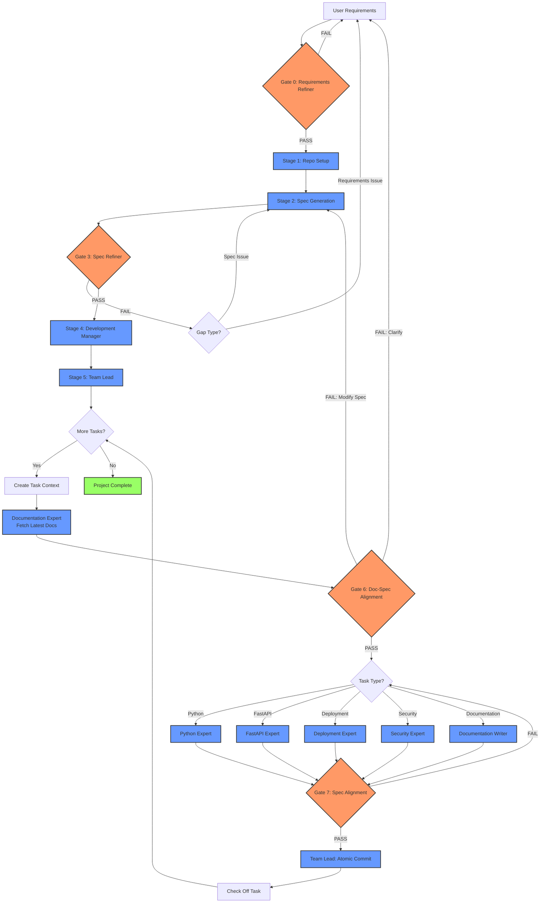

# Agentic Development

Spec-driven development orchestration system for Claude Code. Zero-assumption, gate-enforced, professional execution engine.

## Overview

Agentic Development is a Claude Code plugin that orchestrates software development through specialized agents, enforcing quality gates and spec alignment at every stage. The system learns from each iteration using persistent memory.

**Key Principles:**
- **Zero assumptions**: Gates fail on any ambiguity
- **Spec-driven**: All code generated from validated specifications
- **Atomic commits**: One commit per completed task
- **Self-learning**: Agents track patterns and improve over time
- **Token-efficient**: Context files prevent token bloat

## Installation

Open Claude Code, and type `/plugin`
```bash
> /plugin 
╭─────────────────────────────────────────────────────────────────────────────────────╮
│ Plugins                                                                             │
│                                                                                     │
│   1. Browse and install plugins                                                     │
│   2. Manage and uninstall plugins                                                   │
│ ❯ 3. Add marketplace                                                                │
│   4. Manage marketplaces                                                            │
╰─────────────────────────────────────────────────────────────────────────────────────╯
   Press ↑↓ to navigate · Enter to select · Esc to exit
```

Navigate to `3. Add marketplace` and press `Enter`.

Type in `jsell-rh/agentic-development-plugins` and press `Enter`.

```bash
╭─────────────────────────────────────────────────────────────────────────────────────╮
│ Add Marketplace                                                                     │
│                                                                                     │
│ Enter marketplace source:                                                           │
│ Examples:                                                                           │
│  • owner/repo (GitHub)                                                              │
│  • git@github.com:owner/repo.git (SSH)                                              │
│  • https://example.com/marketplace.json                                             │
│  • ./path/to/marketplace                                                            │
│                                                                                     │
│ jsell-rh/agentic-development-plugins                                                │
╰─────────────────────────────────────────────────────────────────────────────────────╯
   Enter to add · Esc to cancel
```

Follow the rest of the prompts and then **restart Claude Code**.


## Usage

Invoke the orchestrator skill:

```
Please use the Orchestrator skill to perform development against <my-requirements.md>.
```

The orchestrator will guide you through the development cycle, asking clarifying questions at gates.

## Development Flow



## Stages & Agents

### Gates (Quality Control)
- **Gate 0: requirements-refiner** - Validates requirements for completeness
- **Gate 3: spec-kit-refiner** - Validates specs are generative
- **Gate 6: documentation-spec-alignment** - Validates specs against latest library docs, flags discrepancies
- **Gate 7: spec-alignment-reviewer** - Validates code matches specs

### Process Agents
- **Stage 1: repo-setup-expert** - Initializes repo structure, git hooks
- **Stage 2: spec-kit-expert** - Generates spec files (*.spec.md) from requirements
- **Stage 4: development-manager** - Creates phased roadmap
- **Stage 5: team-lead** - Assigns tasks, creates atomic commits

### Stage 6 Agents
- **documentation-expert** (Pre-processor) - Fetches latest docs from internet
- **python-expert** - Python code + tests, type hints, Pydantic
- **fastapi-expert** - FastAPI apps using subrouter pattern
- **deployment-expert** - Dockerfiles (UBI9), Konflux/Tekton CI/CD
- **security-expert** - Security reviews, OWASP compliance
- **documentation-writer** - User-facing docs, README, guides

## Directory Structure (Generated Projects)

```
your-project/
├── specs/                    # Spec files (*.spec.md, spec-kit methodology)
├── docs/                     # Documentation
│   ├── roadmap.md           # Phased implementation plan
│   ├── architecture.md      # System architecture
│   └── security.md          # Security documentation
├── src/                      # Source code
├── tests/                    # Test files
├── .agent-context/          # Task context files (ephemeral)
└── .agent-memory/           # Agent learning files (persistent)
    ├── requirements-refiner.md
    ├── spec-kit-expert.md
    └── ...
```

## Agent Memory System

Each agent maintains a memory file (`.agent-memory/<agent-name>.md`) tracking:
- Patterns observed
- Effective solutions
- Common mistakes
- Project-specific standards

Format:
```markdown
### 2025-01-12T14:30:00Z
- **Pattern**: What was observed
- **Action**: What to do differently
- **Context**: Where/when this occurred
```

Agents read their memory at start and append learnings at end. Max 50 entries.

## Configuration

### Available Stage 6 Agents

The orchestrator knows about these specialists:
- `python-expert`
- `fastapi-expert`
- `deployment-expert`
- `security-expert`
- `documentation-writer`

To add more, see [AGENTS.md](./AGENTS.md).

## Tech Stack Defaults

- **Base Images**: Red Hat UBI9 (hardened)
- **CI/CD**: Konflux (Tekton-based)
- **Python**: 3.13+, Pydantic, Pytest
- **FastAPI**: Subrouter pattern, dependency injection
- **Hooks**: rh-hooks-ai + conventional commits

## Requirements

- Claude Code CLI
- Git
- (Optional) pre-commit

## Contributing

See [AGENTS.md](./AGENTS.md) for instructions on adding/modifying agents.

## License

Apache-2.0
